# Manual de utilização do JRE 
Este manual será responsável pela resolução de dúvidas e demonstração do uso correto do software utilizado em conjunto ao joystick para exercícios respiratórios. 

Utilize o índice abaixo para navegar entre sessões. 

- [Manual de utilização do JRE](#manual-de-utilização-do-jre)
  - [Plataformas suportadas](#plataformas-suportadas)
  - [Instalação e execução](#instalação-e-execução)
  - [Notas gerais sobre o uso](#notas-gerais-sobre-o-uso)
  - [Conexão com joystick](#conexão-com-joystick)
  - [Calibração](#calibração)
  - [Configuração de botões](#configuração-de-botões)
  - [Perfis de configuração](#perfis-de-configuração)
  - [Ações de usuários](#ações-de-usuários)
  - [Estatisiticas de usuário](#estatisiticas-de-usuário)

## Plataformas suportadas
A ferramenta funciona exclusivamente no sistema operacional Windows 

## Instalação e execução
A ferramenta já vem pré-instalada, é apenas necessário descompactar a pasta obtida através do repositório. 

Recomenda-se a utilização da ferramenta [7Zip](https://www.7-zip.org), porém outras ferramentas podem ser utilizadas sem problemas. 

   

**Para utilizar a ferramenta:** 
1. Acesse a pasta "main"
2. Abra a ferramenta através de um clique duplo no executável de nome "main.exe"

## Notas gerais sobre o uso
1. Em diversas operações, a tela da ferramenta é bloqueada e elementos ficarão cinza, indicando que não podem ser utilizados.
   1. Isso é feito para funções conflitantes não sejam executadas em simultâneo.
   2. Aguarde o fim da função sendo realizada para que a ferramenta libere o funcionamento.

## Conexão com joystick
**OBS:** É importante destacar que a conexão do dispositivo deve ser realizada através da ferramenta e não da interface do Windows. A ferramenta só é capaz de detectar o dispositivo caso o mesmo seja conectado através dela. 

A conexão com o joystick é a primeira tela apresentada no software. Outras funcionalidades cruciais não podem ser utilizadas caso o joystick não tenha sido conectado de forma correta. 

   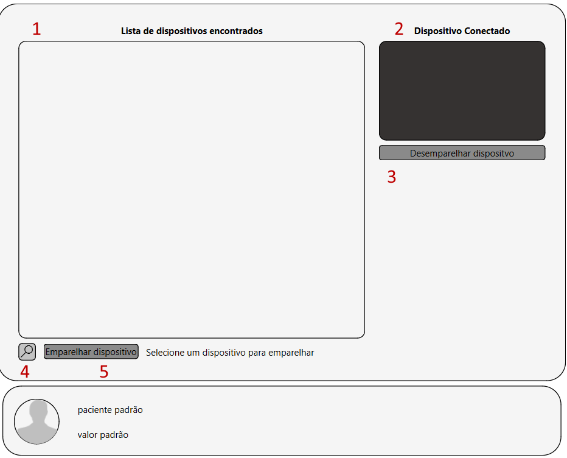

A imagem acima apresenta a tela com os principais elementos numerados. 

1. Lista de dispositivos encontradas
   1.  Atualizada após a utilização do botão de busca de dispositivos.
   2.  Clique no dispositivo encontrado para selecioná-lo para emparelhamento.
   3.  Dispositivos desligados podem aparecer na lista, mas recebem o status de desligado, impedindo a sua conexão.
2. Dispositivo conectado
   1.  Quando desconectado, o quadrado fica cinza-escuro.
   2.  Quando um dispositivo está conectado, suas informações são apresentadas e o quadrado fica laranja.
3. Botão de desemparelhar dispositivo
   1.  Desconecta e esquece informações do dispositivo atualmente conectado. 
   2.  Só pode ser usado quando um dispositivo está conectado.
4. Lupa
   1.  Procura por dispositivos e apresenta dispositivos disponíveis na lista após encontrá-los.
5. Emparelhar dispositivo
   1. Emparelha dispositivo selecionado na lista.

Seu funcionamento é iniciado após o pressionar a lupa, dispositivos devem ser encontrados antes de poderem ser conectados. 

Após pressionar o botão 4 ou lupa, o software tenta encontrar dispositivos, em caso de sucesso, obtemos a seguinte tela. 

   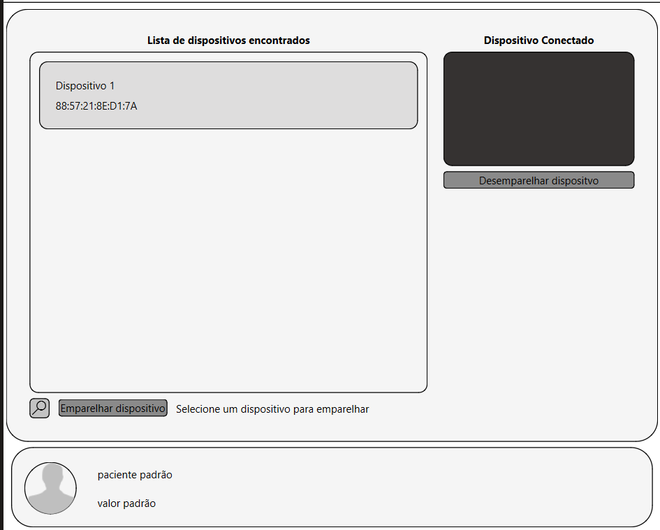

Mais de um dispositivo pode aparecer na lista. 

Para dar continuidade ao processo de conexão, de um clique no dispositivo que deseja conectar, a tela vai ficar com está aparência. 

   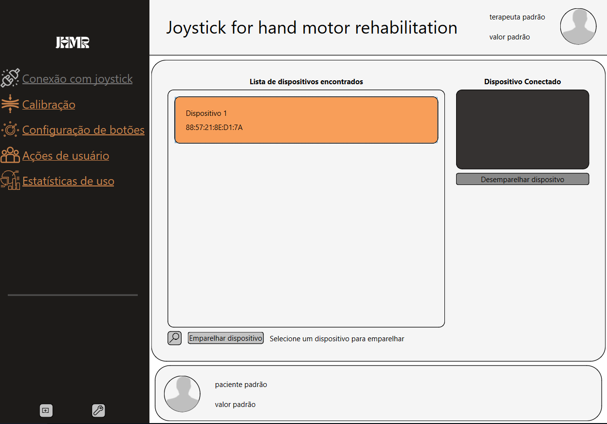

O dispositivo selecionado fica com seu fundo em laranja e o botão de emparelhamento pode ser pressionado. 

Após tocar no botão de emparelhamento e aguardar, o software se conecta ao dispositivo, e a tela de conexão apresenta o dispositivo no quadro anteriormente cinza-escuro e agora laranja. 

   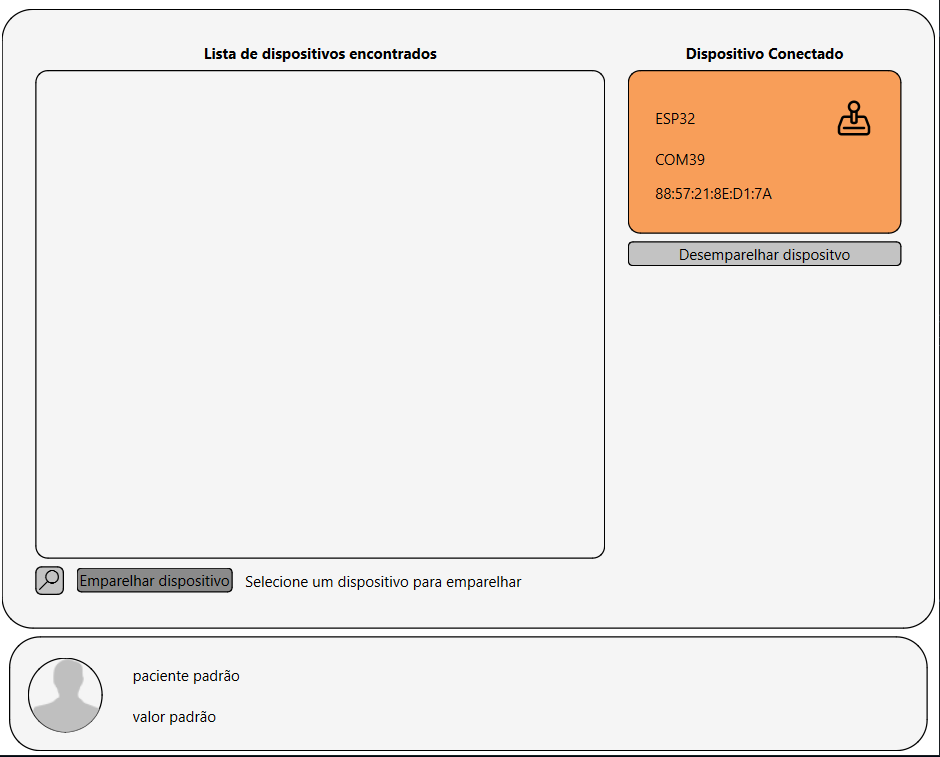

O dispositivo está pronto para uso. 

Caso deseje conectar outro dispositivo, utilize o botão de desemparelhar, ou botão 3. Recomenda-se a atualização da lista de dispositivos após a desconexão. 

## Calibração
A funcionalidade de calibração é utilizada para obter informações sobre a força que o paciente é capaz de exercer sobre o joystick. 

Seu funcionamento é simples, conta com três botões e instruções de como realizar a medição. O processo é composto por duas etapas de medição e a apresentação dos resultados obtidos. 
A imagem abaixo representa a primeira tela de calibração com os principais elementos numerados. 

   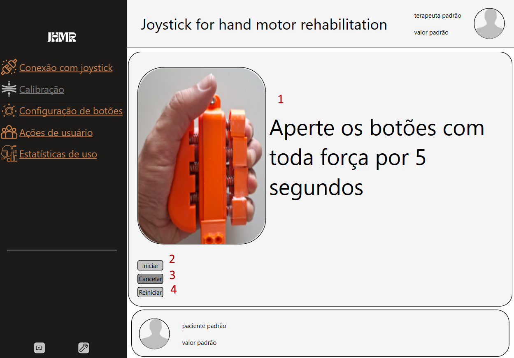

1. Instruções
   1. O combo de imagem e texto é alterado durante o processo com instruções para o paciente.
2. Iniciar
   1. Utilizado para iniciar o processo de calibração, isso envia um comando para o joystick, sinalizando que a ferramenta esta pronta para receber as informações de pressão enviadas.
3. Cancelar
   1. Interrompe o processo de calibração. A etapa é cancelada e as informações obtidas na mesma são descartadas.
   2. Cancela somente a etapa atual, informações da etapa anterior ainda são mantidas.
   3. Só pode ser usado durante o processo de calibração.
4.  Reiniciar
    1.  Limpa informações coletadas até o momento e retorna a primeira tela de calibração.

Segunda etapa de calibração. 

   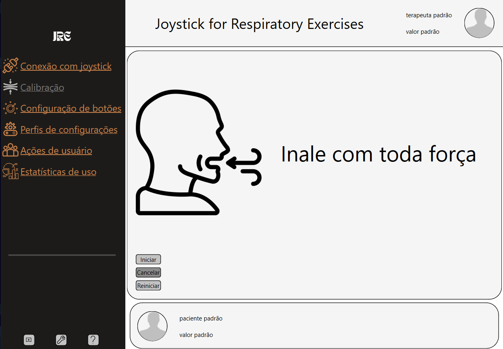

Tela de resultado de calibração. 

   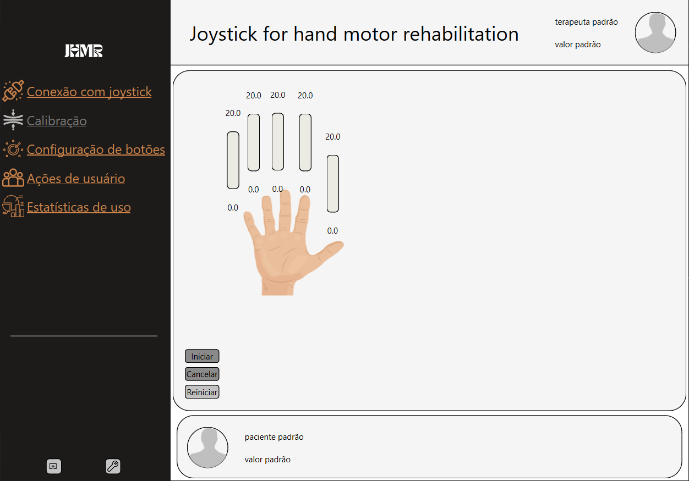

Os resultados são apresentados em kPa. As barras medem o valor em relação ao máximo suportado, 40 kPa. 

Tela da ferramenta durante o processo de calibração. 

   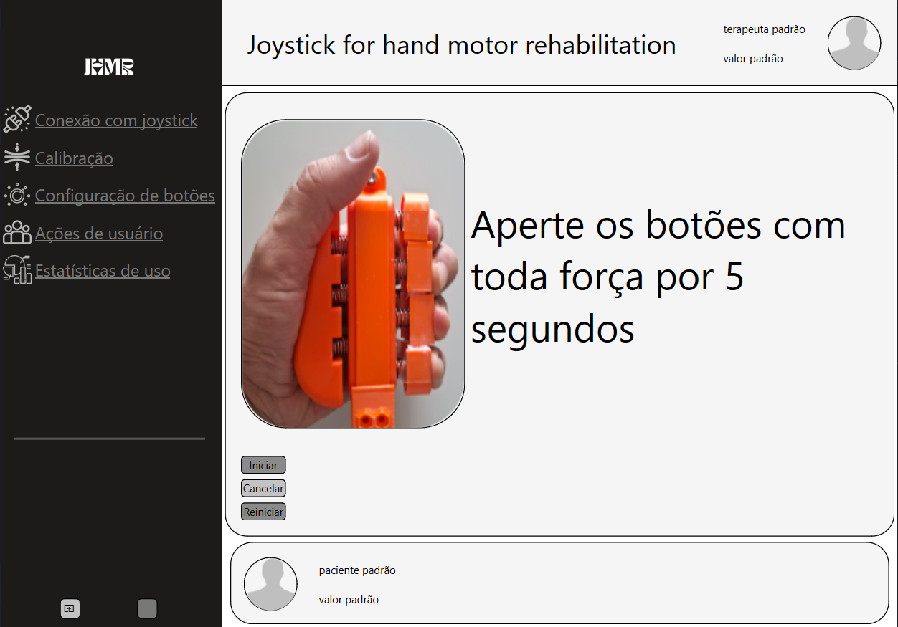

Como [já mencionado](#notas-gerais-sobre-o-uso), outras funcionalidades são bloqueadas durante a calibração.

## Configuração de botões
A tela de configuração de botões é utilizada para associar uma tecla do teclado a uma combinação de dedos e outros parâmetros como pressão e tempo de ativação .

   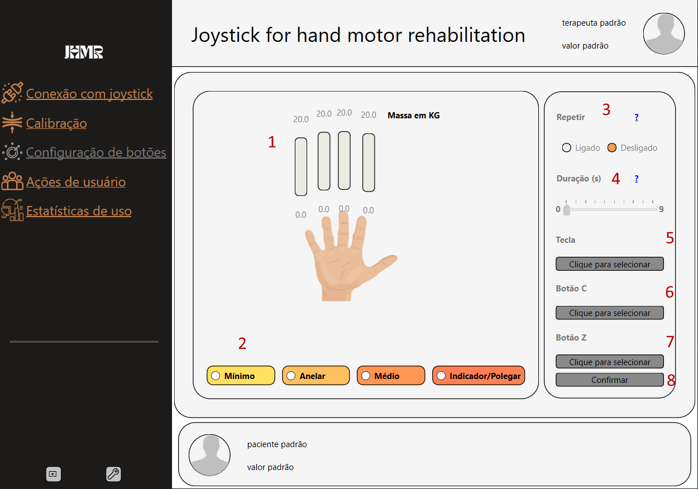

A imagem acima apresenta a tela com os principais elementos numerados. 

1. Controles de pressão
   1. Este grupo de controles deslizantes permite que o usuário atribua um valor de pressão de ativação da ação desejada.
   2. Os valores são apresentados em kPa, com o máximo em 40 kPa.
   3. Pode-se utilizar as setas para cima e para baixo ao configurar o valor de pressão, porém antes é necessário dar um clique no controle deslizante desejado.
   4. Só se pode interagir com um controle deslizante por vez. Apenas uma ação pode ser configurada por vez. Caso o valor e tecla de uma ação tenha sido selecionada, mas o valor da outra ação tenha sido alterado, a tecla e valor de pressão da ação anterior voltará ao valor padrão.
   5. Caso deseje retornar ambos os valores ao padrão, atribua o valor 0 ao controle deslizante de uma ação.
2. Botão repetir
   1. Este botão varia entre ligado e desligado.
   2. Quando ligado, a tecla escolhida será repetida quando o paciente realiza a ação associada a tecla.
   3. Caso contrario, a tecla só será acionada uma vez e o paciente deve utilizar a mesma combinação de dedos para acioná-la novamente.
3. Controle de duração
   1. Determina quantos segundos de pressão continua são necessários para acionar a tecla.
   2. 0 é o mínimo, acionando imediatamente quando o paciente utiliza a ação desejada.
4. Botão sopro
   1. Botão que permite selecionar a tecla que deve ser associada a ação desejada.
   2. Ao clicar, o modal de seleção de teclas (apresentado e explicado no último item) aparece. 
   3. Após escolher uma tecla, o texto da teclas selecionada aparece no botão.
   4. Após confirmar a configuração, o texto da tecla é limpo e retorna para "Clique para selecionar".
5. Botão sucção
   1. Funcionamento identico ao botão sopro.
6. Confirmar
   1. Envia os parâmetros de configuração para o joystick.
   2. Após o fim da transmissão, apresenta um modal com mensagens de sucesso ou falha na configuração de parâmetros.
   3. Retorna a tela ao seu estado inicial.

A imagem abaixo representa o modal de escolha de teclas.

   

1. Utilize o teclado para escolher uma tecla.
2. Depois de feita a escolha, clique no botão OK.

**Como exemplo, vamos configurar a ação de sopro para a ativação da a tecla A.**
**Os parâmetros desta configuração são:**
1. 10 kPa de pressão;
2. 1 segundo de duração para ativação;
3. Repetição ligada;
   
A sequência de imagens a seguir apresenta o passo a passo. 

Primeiro, atribuímos a pressão utilizando o controle deslizante.

   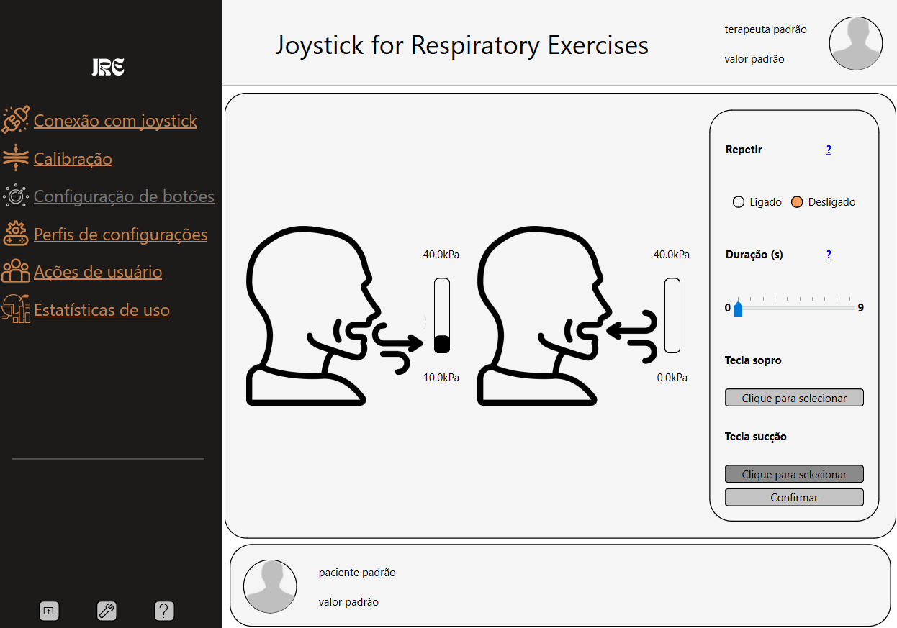

Depois, atribuímos a tecla desejada.

   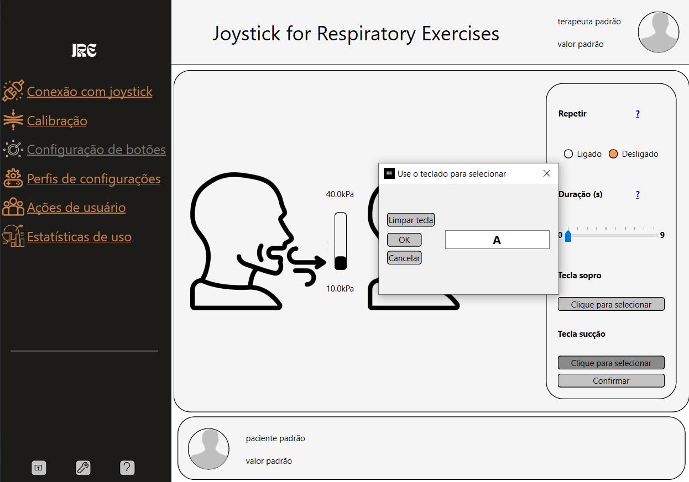

Por fim, atribuímos os parâmetros de repetição e tempo.

   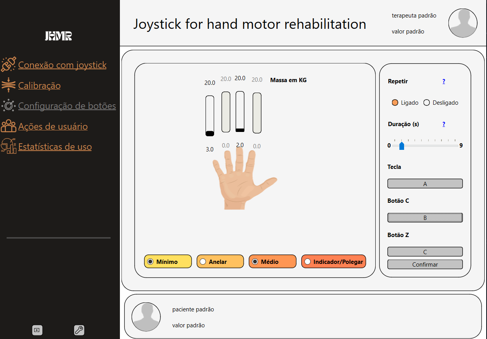

Agora o joystick está configurado.

   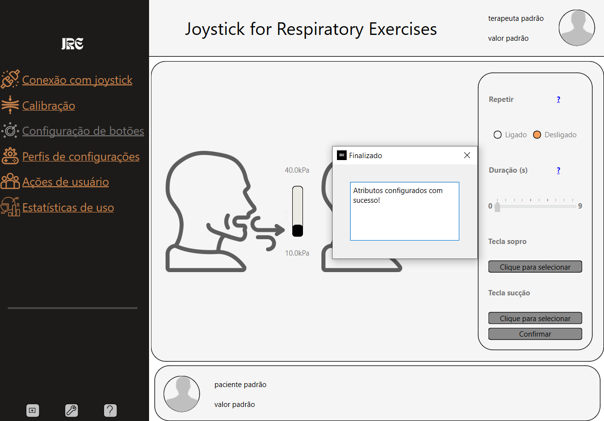

Nesse ponto, a tela retorna ao estado inicial e é possível configurar outras combinações de dedos.

## Perfis de configuração
Registro de perfis de configuração. Um perfil de configuração é um conjunto de configurações do joystick, separado por paciente, que podem ser aplicadas de forma individual ou em conjunto. 
Esta funcionalidade tem como objetivo acelerar o processo de configuração do joystick para pacientes recorrentes, que realizam o mesmo exercício com o mesmo jogo ou configurações em diversas seções.

   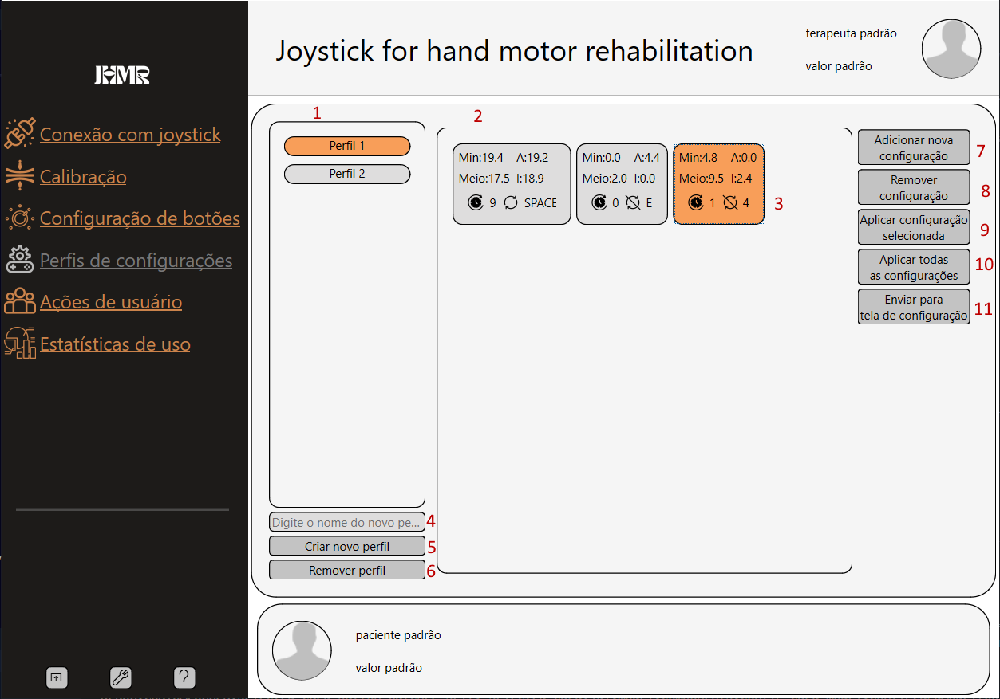

A imagem acima apresenta a tela com os principais elementos numerados. 

1. Lista de perfis de configuração
   1. Perfis armazenados no banco de dados são apresentados nesta lista.
   2. Perfis são associados a pacientes e não são compartilhados.
   3. Armazenam as configurações apresentadas na lista de configurações (item 2).
   4. Configurações podem ser adicionadas digitando um nome no campo de texto (item 4) e clicando no botão 5.
   5. Podem ser selecionadas ao clicar no perfil desejado.
2. Lista de configurações
   1. Configurações adicionadas ao perfil.
   2. Podem ser selecionadas ao clicar na configuração desejada.
3. Configuração selecionada
   1. Tem sua cor alterada.
   2. As informações contidas são elaboradas abaixo no manual.
4. Campo de texto
   1. Use para escolher o nome do perfil
   2. Limite de 32 caracteres.
   3. Obrigatório.
5.  Botão "Criar novo perfil"
    1. Adiciona um perfil vazio com o nome digitado.
6.  Botão "Remover perfil" 
    1. Exclui o perfil selecionado com todas as suas configurações.
7.  Botão "Adicionar configuração"
    1. Adiciona a última configuração realizada na tela de configurações ao perfil selecionado.
8.  Botão "Remover configuração"
    1. Exclui a configuração selecionada do perfil.
9.  Botão "Aplicar configuração selecionada"
    1.  Envia a configuração selecionada ao joystick.
    2.  Mesma ação de configurar o joystick através da tela de configuração.
10. Botão "Aplicar todas as confiuração"
    1.  Aplica todas as configurações do perfil ao joystick.
11. Botão "Enviar para tela de configuração"
    1.  Envia as informações de configuração selecionada à tela de configuração. 

O item de configuração é apresentado na imagem abaixo. 

   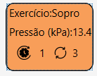

As informações apresentadas, da direita para a esquerda, são:

1. Exercicio.
   1. Descreve a ação associada a teclas.
2. Pressão
   1. Apresenta a pressão associada a tecla em kPa.
3. Duração de pressão necessaria
   1. Apresentada em segundos.
4. Repetição   
   1. Ícone apresenta a repetição ligada ou desligada.
5. Tecla selecionada
   1. Apresenta a tecla associada a combinação de botões.

Uso da funcionalidade:

1. Realize uma configuração do joystick na tela de configurações.
2. Acesse a tela de perfis de configuração.
3. Crie um novo perfil.
4. Selecione o perfil criado.
5. Use o botão 7 para adicionar a última configuração realizada.
6. Repita o processo para adicionar mais configuração ao perfil selecionado.

Agora temos um perfil com diversas configurações armazenadas. 
Em qualquer outro momento que desejamos aplicar a mesma configuração ao joystick:

1. Selecione o perfil desejado.
2. Selecione a configuração desejada.
3. Utilize o botão 9 para aplicar a configuração desejada.
4. Ou utilize o botão 10 para aplicar todas as configurações do perfil.

## Ações de usuários
Cadastro e gerenciamento de pacientes e terapeutas.

Atualmente, da-se atenção especial ao cadastro de pacientes. **Duas características são relevantes.**
1. É completamente independente do terapeuta ativo;
2. É utilizado para determinar as sessões apresentadas na tela de [estatisiticas de usuário](#estatisiticas-de-usuário).

   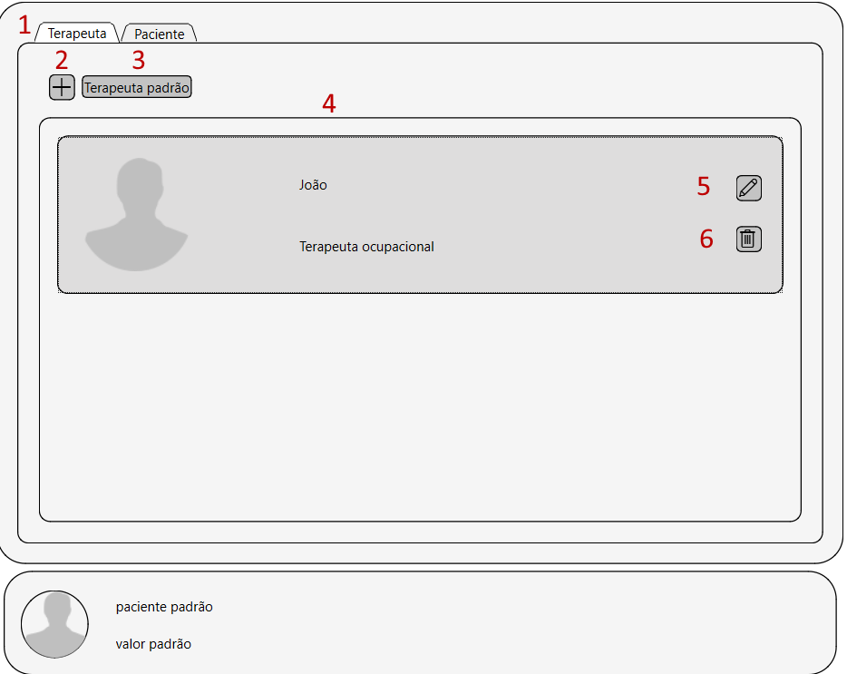

A imagem acima apresenta a tela com os principais elementos numerados. 

1. Seleção de aba
   1. Esta tela apresenta duas abas bem similares.
   2. Cadastro e gerenciamento de terapeutas e de clientes.
   3. Utilize o botão de seleção de aba para navegar entre elas.
2. Novo cadastro
   1. Abre o modal de cadastro.
   2. Cadastros corretos aparecem na lista.
3. Terapeuta/Paciente padrão
   1. A ferramenta é iniciada com um valor de paciente e terapeuta padrões.
   2. Estes valores são genéricos e podem ser usados por qualquer usuário.
   3. Similar a função de "convidado" presente em diversos websites e softwares.
   4. Utilize este botão para retornar ao valor padrão.
4. Lista de cadastros
   1. Pacientes e terapeutas cadastrados aparecem em suas respectivas listas.
   2. Pode-se selecionar um paciente ou terapeuta clicando no item do mesmo na lista.
5. Edição de cadastro
   1. Informações podem ser alteradas para cada cadastro individual.
6. Remover cadastro
   1. Este botão deleta o cadastro selecionado.
   2. Caso seja um cadastro de paciente, todas as suas seções também são removidas.

A sequência de imagens a seguir apresenta o passo a passo de cadastro de um paciente, o mesmo processo pode ser utilizado para terapeutas. 

   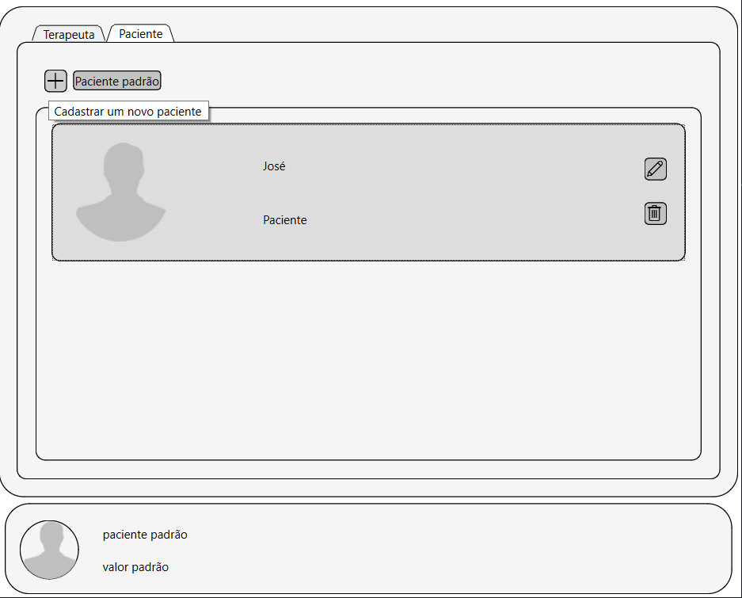   

   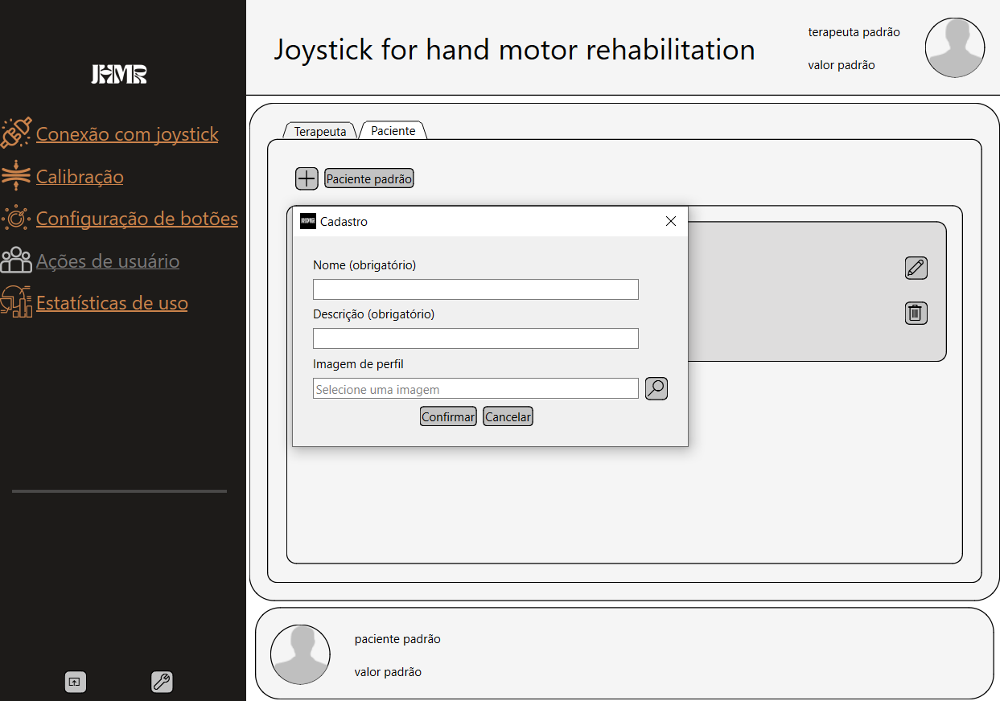   

   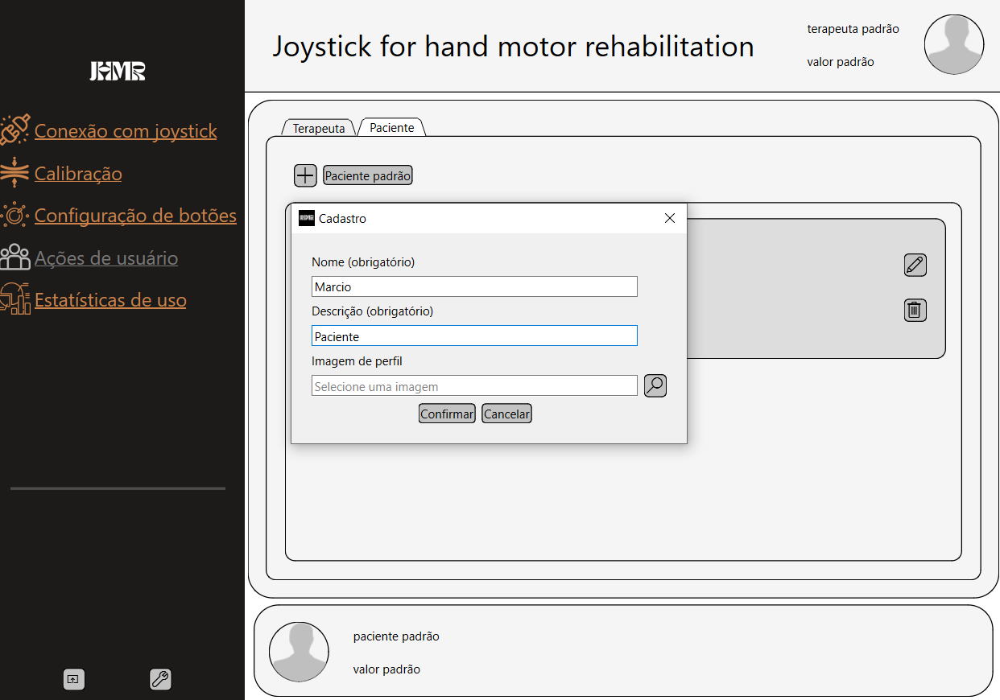   

   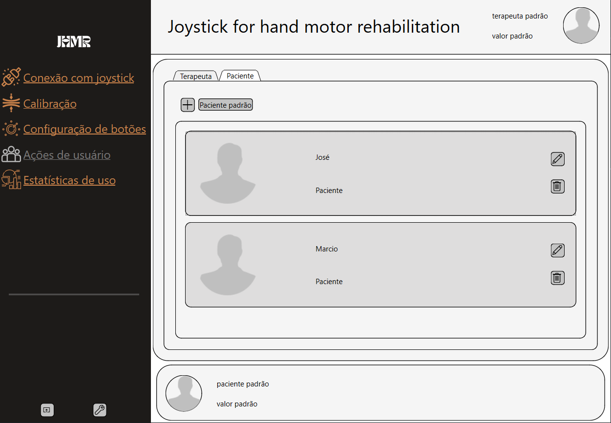   

   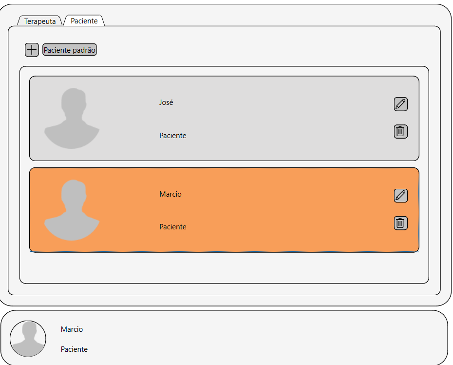   

Observe a parte inferior da ferramenta, ela apresenta o paciente atualmente selecionado.

## Estatisiticas de usuário
Esta tela é utilizada para obter e monitorar as estatísticas de uso do joystick durante o tratamento, permitindo que o terapeuta tenha uma visão clara do progresso do paciente em seu tratamento. 

Ela conta com duas abas principais, sessão e resumo. 
1. Sessão demonstra informações armazenadas na sessão atual através de gráficos. Além disso, apresenta controles de sessão como criação e remoção de sessões e opções de exportação de dados brutos ou imagens dos gráficos;
2. Resumo, que apresenta um resumo de todas as sessões realizadas pelo paciente, demonstrando seu progresso durante o tratamento.

   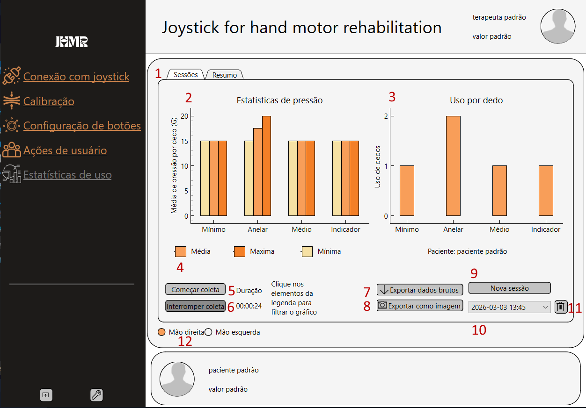 

A imagem acima apresenta a tela com os principais elementos numerados. 

1. Seletor de abas
   1. Estes botões permite o usuário troque entre as abas de resumo e sessões.
   2. A aba de resumo não apresenta botões extra.
2. Gráfico de estatisticas de pressão
   1. Apresenta informações estisticas sobre valores de pressão coletados na sessão atual.
3. Gráfico de função respiratória
   1. Apresenta o número total de vezes que um exercicio foi realizado.
4. Legenda interativa
   1. É possível escolher quais dados devem ou não aparecer no gráfico ao clicar nos quadrados coloridos.
5. Botão "Começar coleta"
   1. Envia uma mensagem para o joystick indicando que a ferramenta esta armazenando dados de uso.
   2. Bloqueia outras funcionalidades da ferramenta.
   3. O uso desta função é estritamente necessário, caso contrario, o joystick não consegue enviar informações de uso para a ferramenta e elas não serão armazenadas.
6. Botão "Interromper coleta"
   1. Termina a coleta de dados atual.
   2. Desbloqueia as funcionalidades da ferramenta.
7. Botão "Exportar dados brutos"
   1. Dados de todos os gráficos são exportados para diversos arquivos CSV.
   2. Armazenados em uma pasta na pasta raiz da ferramenta, mesma onde o executável se encontra.
   3. Pastas são separadas por paciente.
8. Botão "Exportar como imagem"
   1. Duas imagens são geradas, na mesma estrutura de pastas utilizada pelo botão "Exportar dados brutos".
   2. As imagens representam os gráficos da aba de sessão e resumo.
9. Botão "Nova sessão"
   1.  Cria uma nova sessão vazia, utilizando as informações de data e hora do momento de criação.
10. Seletor de sessões
   1. Uma lista que apresenta todas as sessões.
   2. Sessões são separadas por momento de criação, varias sessões no mesmo dia podem existir.
   3. Esquema de nomeação: Ano-Mês-dia hora:minuto
11. Botão "excluir sessão"
   1. Exclui a sessão atual e todos seus dados.

Detalhes importantes   
1. Atualizações dos gráficos não ocorrem em tempo real. É necessário terminar a coleta para que os gráficos sejam atualizados.

A sequência de imagens apresenta os vários estados da tela. 

Durante a coleta de dados.

   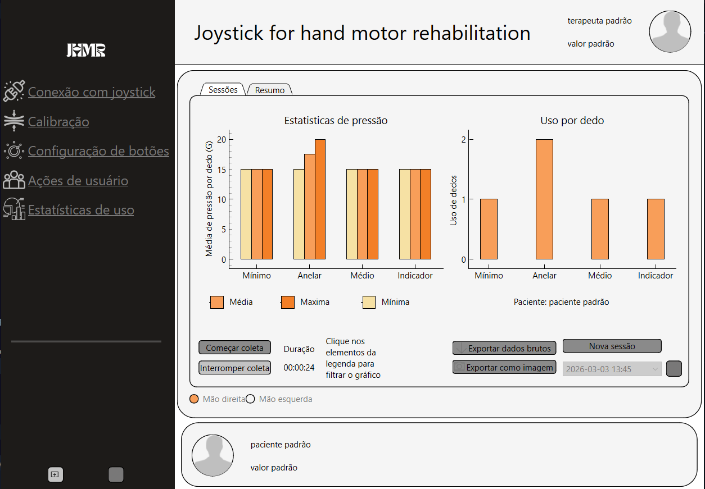

Aba de resumo.

   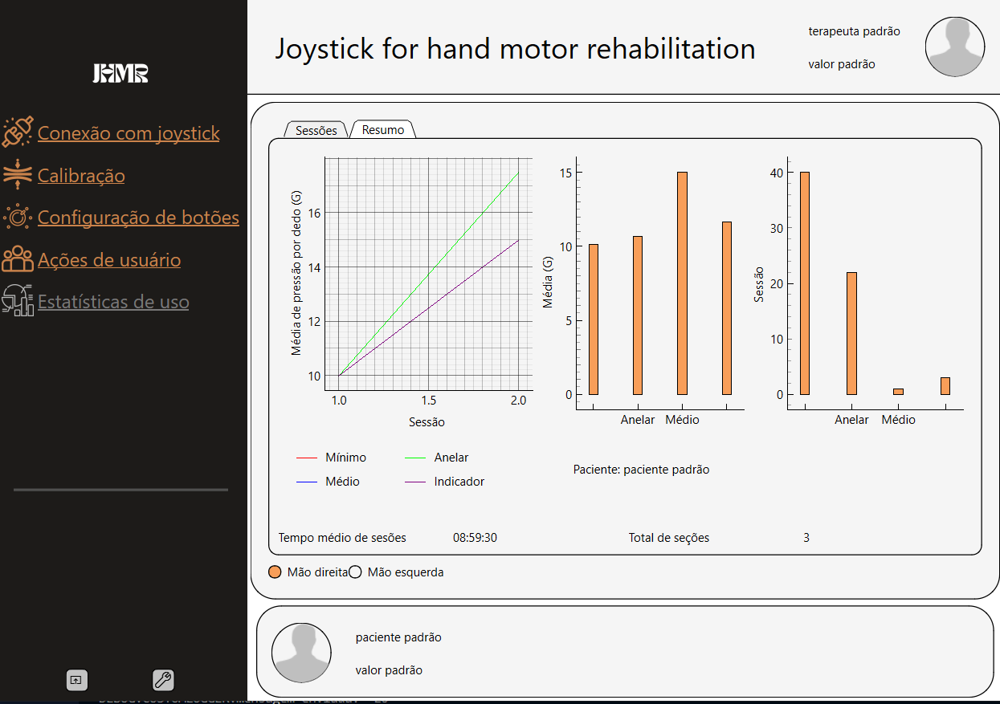

Aba de resumo com gráfico filtrado.

   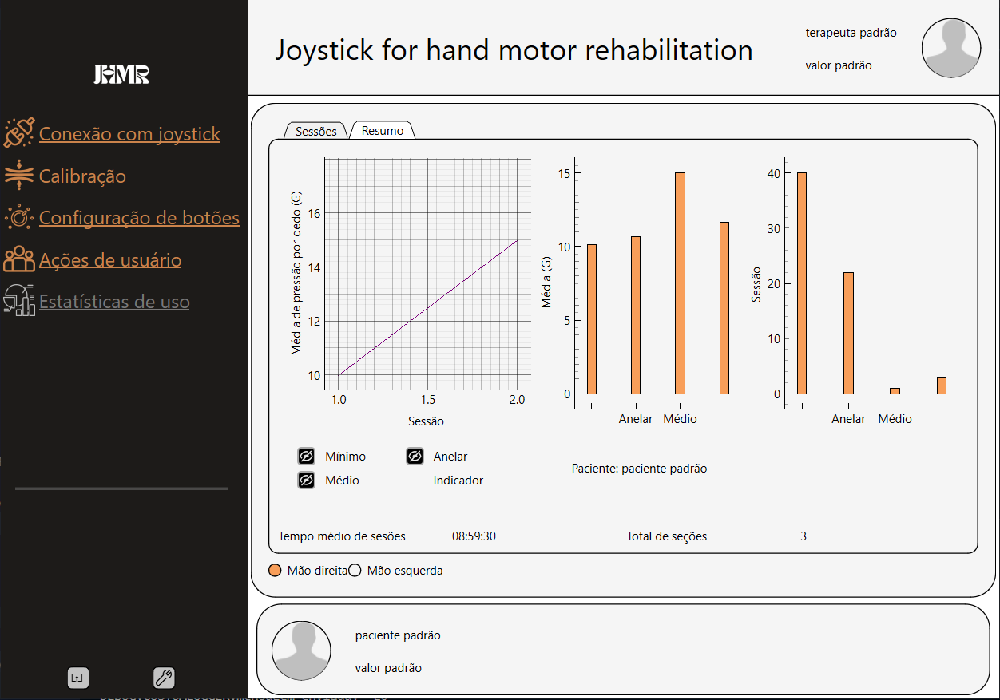

Aba de sessão com gráfico filtrado.

   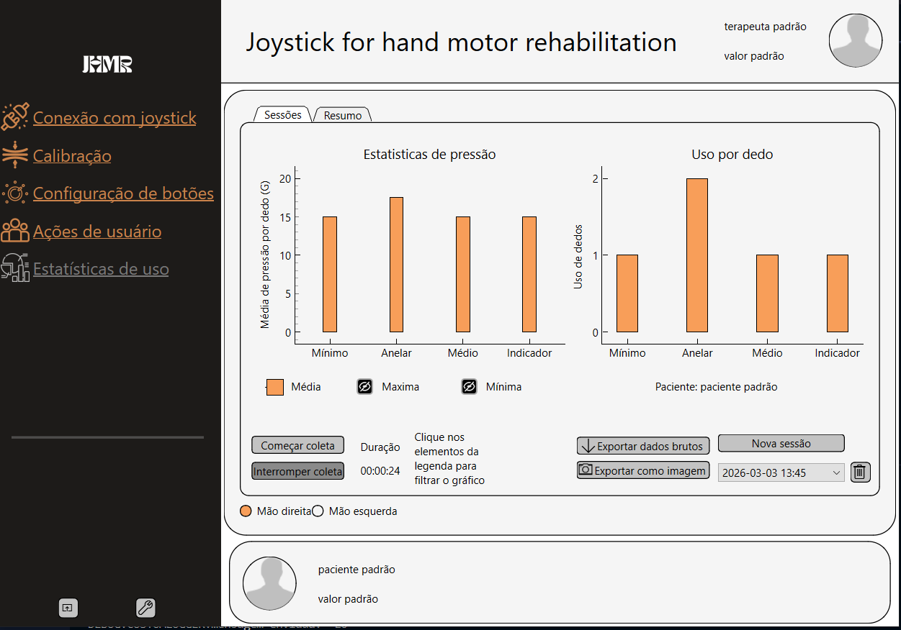

